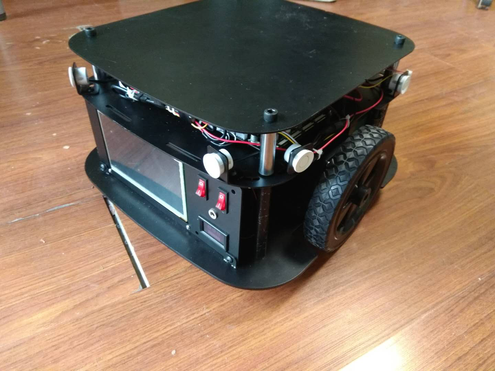
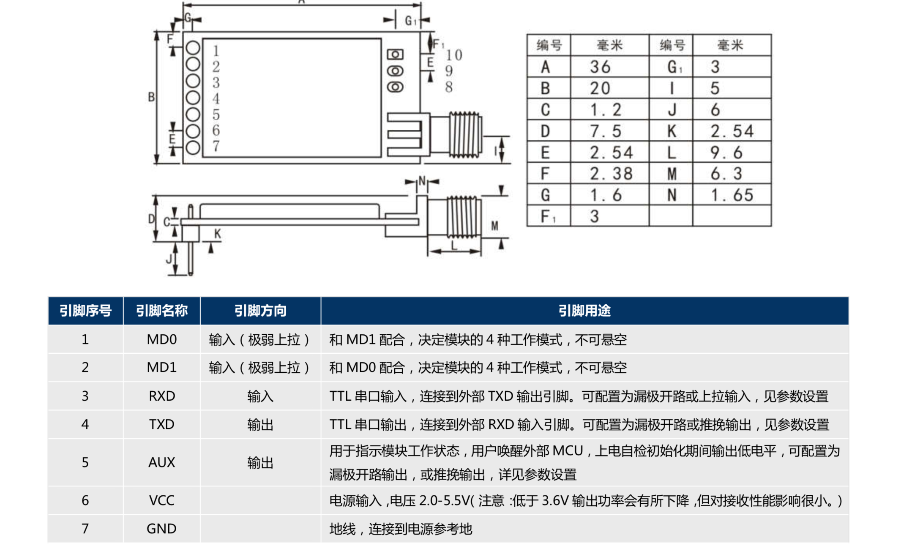
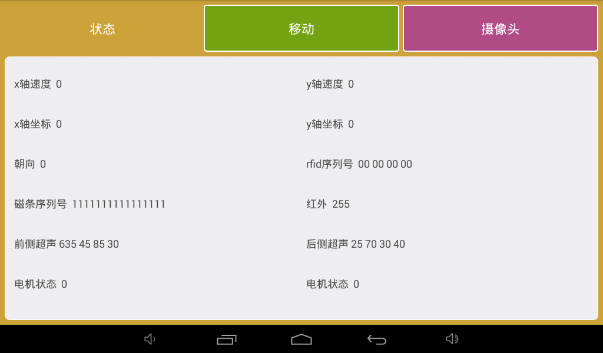
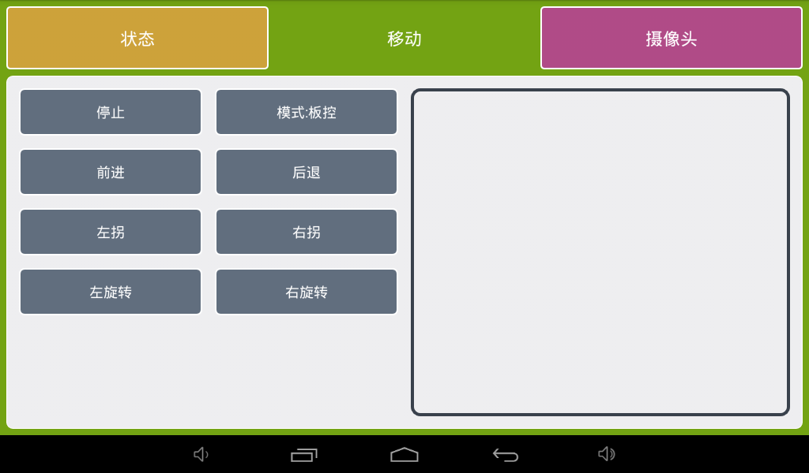
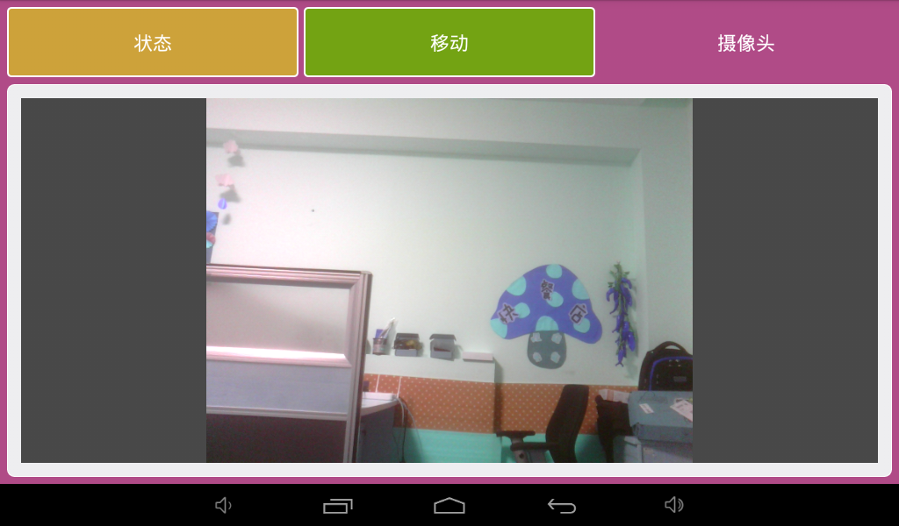
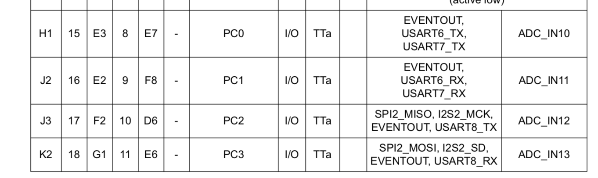

* content
{:toc}

本文档介绍了用rayland-dual主板控制小车的控制协议。协议共分两种，1，用内置的安卓系统。2，用外置的ROS系统。3，用外置的CAN总线接口

## AGV小车接线方法

上图所示AGV小车的外设默认配置

| 设备      | 个数         |
| ------- | ---------- |
| 7寸高清触摸屏 | 1          |
| 超声测距    | 8          |
| RFID    | 1          |
| 16通道寻磁  | 1          |
| 麦克风     | 1（可选4通道）   |
| 2w扬声器   | 1          |
| UVC摄像头  | 1（可选扫码摄像头） |

总体接线图

| 板上电机端口 | AGV功能链接 | 备注                                                         |
| ------------ | ----------- | ------------------------------------------------------------ |
| X电机端口    | 左轮驱动    | 1EN(EN)，2FR(MS1)，3PG(MS2)，4BK(ST)                         |
| Y电机端口    | 右轮驱动    | 1EN(EN)，2FR(MS1)，3PG(MS2)，4BK(ST)                         |
| Z电机端口    | 接CAN总线   | 直接插入CAN板                                                |
| E0电机端口   | 左右轮SV    | 1GND，2 SV_左，3 SV_右，4GND 直连板接E0DIR和E0EN             |
| E1电机端口   | 寻磁        | 1GND，2TX，3RX，4GND。(E1DIR和usart3_RX复用，E1STEP和usart3_tx复用) |
| usart1       | rfid        | 1GND，2TX，3RX，4GND                                         |
| usart2       | 超声        | 1GND，2TX，3RX，4GND                                         |
| usart3       | 遥控器      | 1GND，2TX，3RX，4GND                                         |
| usb口        | 摄像头      | VLC免驱摄像头                                                |
| 音频输入     | 单mic       |                                                              |
| 音频输出     | 运放模块    |                                                              |
| TEMP0        | 电量检测    | 需要对板上接口进行如下改装，拆除R418电阻并按照下图制作连接线 |

### 遥控接线图

遥控使用了lura 433Mhz的

需要做如下的短接板，插在E1口上

## 安卓系统下的AGV 小车控制协议

### 安卓运行界面

状态显示界面

控制界面

看听说界面

##  AGV

`Android -> Stm32`

1.1 **控制指令** `cmd_type,pkg_length,seq,v_x,v_y,s_x,s_y`

| Param      | Describe |  Type  |   Range    |             Unit |
| ---------- | :------: | :----: | :--------: | ---------------: |
| cmd_type   |   指令类型   | uint8  |     0      |                  |
| pkg_length |   包长度    | uint8  | `12bytes`  |                  |
| seq        |   指令序号   | uint8  |            |                  |
| is_reset   |   是否抢占   | uint8  |            | `0:false 1:true` |
| v_x        |   x轮速度   | int16  | -500 ~ 500 |    `(1/10)r/min` |
| v_y        |   y轮速度   | int16  | -500 ~ 500 |    `(1/10)r/min` |
| s_x        |   x轮里程   | uint16 |            |    `1 = (1/10)r` |
| s_y        |   y轮里程   | uint16 |            |    `1 = (1/10)r` |

2.2 **定义当前坐标** `cmd_type,pkg_length,seq,axis_x,axis_y,ori`

| Param      | Describe | Type  |    Range |                              Unit |
| ---------- | :------: | :---: | -------: | --------------------------------: |
| cmd_type   |   指令类型   | uint8 |        1 |                                   |
| pkg_length |   包长度    | uint8 | `9bytes` |                                   |
| seq        |   指令序号   | uint8 |          |                                   |
| axis_x     |   x轴坐标   | int16 |          |                     `1 = (1/10)r` |
| axis_y     |   y轴坐标   | int16 |          |                     `1 = (1/10)r` |
| ori        |    朝向    | int16 |          | `1 = 1/10°` `-1 = -1/10°` (逆时针为正) |

3.3 **切换控制模式** `cmd_type,pkg_length,seq,controll_type`

| Param         | Describe | Type  |                   Range | Unit |
| ------------- | :------: | :---: | ----------------------: | ---: |
| cmd_type      |   指令类型   | uint8 |                       2 |      |
| pkg_length    |   包长度    | uint8 |                `4bytes` |      |
| seq           |   指令序号   | uint8 |                         |      |
| controll_type |   控制模式   | uint8 | `0：板控` `1：遥控` `2：ROS控制` |      |

`Stm32 -> Android`

1.1 **状态采集** 

`cmd_type,pkg_length,seq,v_x,v_y,axis_x,axis_y,ori,rfid,magn,infra,ut_f,ut_b,moto_state,mile`

| Param       | Describe |     Type     |                          Range |                              Unit |
| ----------- | :------: | :----------: | -----------------------------: | --------------------------------: |
| cmd_type    |   指令类型   |    uint8     |                              0 |                                   |
| pkg_length  |   包长度    |    uint8     |                      `39bytes` |                                   |
| seq         |   指令序号   |    uint8     |                                |                                   |
| controlType |   控制类型   |    uint8     |        `0：板控` `1：遥控` `2：ROS控制` |                                   |
| v_x         |   x轴速度   |    int16     |                     -500 ~ 500 |                     `(1/10)r/min` |
| v_y         |   y轴速度   |    int16     |                     -500 ~ 500 |                     `(1/10)r/min` |
| axis_x      |   x轴坐标   |    int16     |                                |                     `1 = (1/10)r` |
| axis_y      |   y轴坐标   |    int16     |                                |                     `1 = (1/10)r` |
| ori         |    朝向    |    int16     |                                | `1 = 1/10°` `-1 = -1/10°` (逆时针为正) |
| rfid        | rfid序列号  |    uint32    |                                |                                   |
| magn        |  磁条序列号   |    uint16    |              `0:missing 1:hit` |                                   |
| infra       |    红外    |    uint8     |               `0:false 1:true` |                                   |
| ut_f        |   前侧超声   | uint16 * `4` |                                |                              `mm` |
| ut_b        |   后侧超声   | uint16 * `4` |                                |                              `mm` |
| moto_state  |   电机状态   |    uint8     | `0:stop 1:running` 左侧第0位 右侧第一位 |                                   |
| mile        |   总里程    |    uint16    |                                |                              `mm` |

## ros系统下的AGV 小车控制协议

板载的A33处理器并不能运行ROS操作系统，需要通过外接mini PC来完成。MiniPC直接和板子上的STM32进行通讯，在ros模式下，我们需要禁用板载的寻磁传感器功能，将这个口用来做miniPC和STM32的通讯。

MiniPC -> Stm32

1.1 **控制指令** `cmd_type,pkg_length,seq,v_x,v_y,s_x,s_y`

| Param      |  Describe   |  Type   |   Range    |             Unit |
| ---------- | :---------: | :-----: | :--------: | ---------------: |
| prefix     |     包头      |  uint8  |    0x68    |                  |
| cmd_type   |    指令类型     |  uint8  |     0      |                  |
| pkg_length |     包长度     |  uint8  | `12bytes`  |                  |
| seq        |    指令序号     |  uint8  |            |                  |
| is_reset   |    是否抢占     |  uint8  |            | `0:false 1:true` |
| v_x        |    x轮速度     |  int16  | -500 ~ 500 |    `(1/10)r/min` |
| v_y        |    y轮速度     |  int16  | -500 ~ 500 |    `(1/10)r/min` |
| s_x        |    x轮里程     | uint16  |            |    `1 = (1/10)r` |
| s_y        |    y轮里程     | uint16  |            |    `1 = (1/10)r` |
| checksum   | 校验和（不含包头包尾） | uint8_t |   0~255    |                  |
| subfix     |     包尾巴     | uint8_t |    0xff    |                  |

Stm32-> MiniPC 

| Param      |  Describe   |     Type     |                          Range |                              Unit |
| ---------- | :---------: | :----------: | -----------------------------: | --------------------------------: |
| prefix     |     包头      |    uint8     |                           0x68 |                                   |
| cmd_type   |    指令类型     |    uint8     |                              0 |                                   |
| pkg_length |     包长度     |    uint8     |                      `39bytes` |                                   |
| seq        |    指令序号     |    uint8     |                                |                                   |
| v_x        |    x轴速度     |    int16     |                     -500 ~ 500 |                     `(1/10)r/min` |
| v_y        |    y轴速度     |    int16     |                     -500 ~ 500 |                     `(1/10)r/min` |
| axis_x     |    x轴坐标     |    int16     |                                |                     `1 = (1/10)r` |
| axis_y     |    y轴坐标     |    int16     |                                |                     `1 = (1/10)r` |
| ori        |     朝向      |    int16     |                                | `1 = 1/10°` `-1 = -1/10°` (逆时针为正) |
| rfid       |   rfid序列号   |    uint32    |                                |                                   |
| magn       |    磁条序列号    |    uint16    |              `0:missing 1:hit` |                                   |
| infra      |     红外      |    uint8     |               `0:false 1:true` |                                   |
| ut_f       |    前侧超声     | uint16 * `4` |                                |                              `mm` |
| ut_b       |    后侧超声     | uint16 * `4` |                                |                              `mm` |
| moto_state |    电机状态     |    uint8     | `0:stop 1:running` 左侧第0位 右侧第一位 |                                   |
| mile       |     总里程     |    uint16    |                                |                              `mm` |
| checksum   | 校验和（不含包头包尾） |   uint8_t    |                          0~255 |                                   |
| subfix     |     包尾巴     |   uint8_t    |                           0xff |                                   |

## Can总线下的通讯协议

在不使用板载的A33板卡时，可以使用外置的CAN总线来对小车进行控制，因为CAN默认总线长度为8Byte，收发协议如下

###can板接口

stm32下一共有三组Can板接口，分别是

| 编号 | 位置       | 是否接出来    |
| ---- | ---------- | ------------- |
| 1    | PA11和PA12 | 否            |
| 2    | PB8和PB9   | E0_dir和E1_EN |
| 3    | PD0和PD1   | 否            |

CAN口的定义如下

| 管脚 | Pin   | 备注   |
| ---- | ----- | ------ |
| 1    | GND   |        |
| 2    | CAN_H |        |
| 3    | CAN_L |        |
| 4    | VCC   | 5V输出 |

CAN和遥控需要一个外接小板子，用STM32F091RC来做

can接在下面这个接口

'

can协议如下：

上位机->CAN->STM32

| Param     | Describe |  Type  |   Range    |          Unit |
| --------- | :------: | :----: | :--------: | ------------: |
| v_x       | x轮速度  |  int8  | -127 ~ 127 |       `r/min` |
| v_y       | y轮速度  |  int8  | -127 ~ 127 |       `r/min` |
| s_x       | x轮里程  | uint16 |            | `1 = (1/10)r` |
| s_y       | y轮里程  | uint16 |            | `1 = (1/10)r` |
| is_brake  | 是否刹车 | uint8  |    0/1     |  代表是否刹车 |
| preserved |   保留   | uint8  |            |      暂无用途 |

STM32->CAN->上位机，最近100ms的里程数
| Param | Describe  |  Type  | Range  |         Unit |
| ----- | :-------: | :----: | :----: | -----------: |
| v_x   | preserved | uint16 |   -    |            - |
| v_y   |   电压    | uint16 | 0~4095 |  代表从0~24V |
| s_x   |  x轮里程  | uint16 |        | `1 = 1pulse` |
| s_y   |  y轮里程  | uint16 |        |  `1 = pulse` |

## 遥控模式

下面这个板子同时用来做Can转接板和遥控板，我们同时用了Can口输出和串口输出，同时接了4个开关。

### 遥控模式接法

遥控模式需要接三种接口，电位接口，遥控器接口和按键接口。

#### 按键接法

以按键1为例子，按键短接中间两个PIN就可以

#### 遥控器接口

#### 电位接口

参照AD口的位置

注意这里电位器需要接在VCC3.3上面，而不能直接接在VCC上面，否则会烧板子。

## 开发记录

2018年09月15日调试如下：

- [ ] AD采集
  - [ ] AD初始化
- [ ] 无线口发射
- [ ] 按键口采集 

