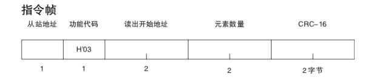

* content
{:toc}

## CRC16

每条命令后面都有CRC格式的计算，这里用的算法是ModBus的算法

```c++
uint16_t crc16(uint8_t array[],uint8_t len){
    uint16_t retVal = 0xFFFF;
    for(int i=0;i<len;i++){
	uint16_t temp = array[i];
	retVal ^= (temp&0x00FF);
	for(int j=0;j<8;j++){
	    if(retVal&0x0001){
		//for LSB == 1
		retVal = retVal>>1;
		retVal ^= 0xA001;
	    }else{
		//for LSB == 0
		retVal = retVal>>1;
	    }
	    //retVal &= ~0x8000;
	}
    }
    return retVal;
}
```


## 连续写间隔

连续写间隔必须大于一定时间，不然写没有反应

## 命令列表



### 读取当前温度

```c++
		thisE5CCConverter.b.prefix = 0x01;
		thisE5CCConverter.b.cmdId = 0x03;
		thisE5CCConverter.b.addrH = 0x00;
		thisE5CCConverter.b.addrL = 0x00;
		thisE5CCConverter.b.cntH = 0x00;
		thisE5CCConverter.b.cntL = 0x02;
	
```


| 编号    | 典型值  | 备注       |
| ----- | ---- | -------- |
| Byte0 | 0x01 | 从站地址     |
| Byte1 | 0x03 | 指令 编号    |
| Byte2 | 0x00 | 地址高8位    |
| Byte3 | 0x00 | 地址低8位    |
| Byte4 | 0x00 | 数据长度高8位  |
| Byte5 | 0x02 | 数据长度低8位  |
| Byte6 | 0xC4 | crc16高8位 |
| Byte7 | 0x0B | crc16低8位 |
|       |      |          |

### 读取设定温度


