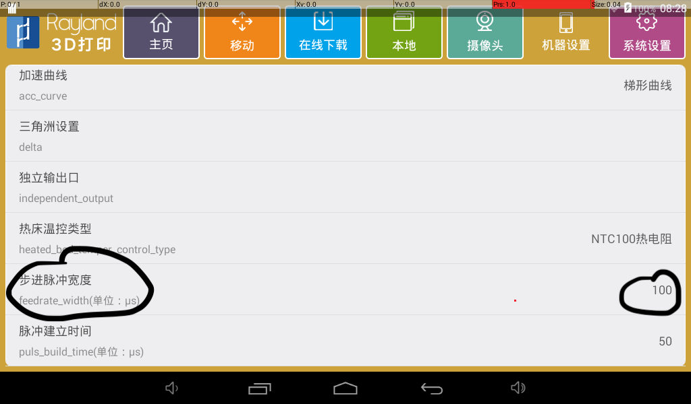
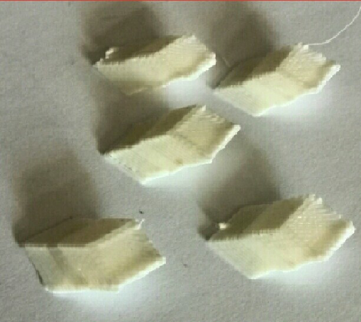
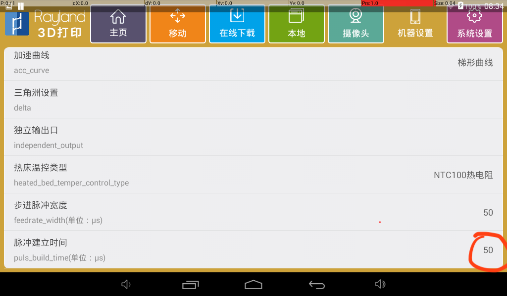
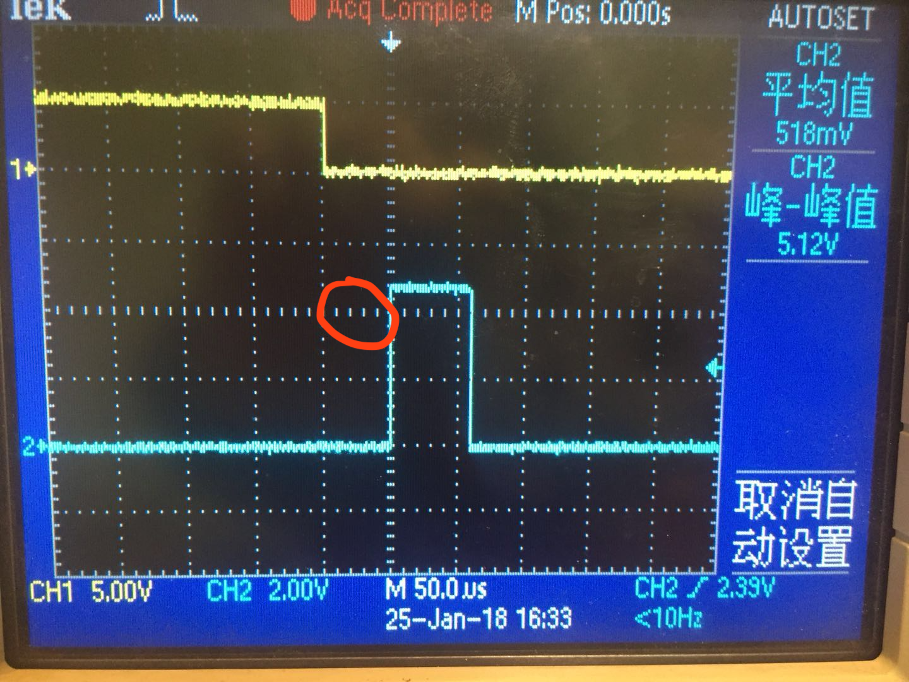

* content
{:toc}
RAYLAND-DUAL是乐轩锐蓝推出的国内首款基于Android的嵌入式电控主板，集核心板和控制板于一体，可同时连接5个异构电机接口、6个风扇/加热棒、6个碰撞开关，并提供WiFi和SD卡扩展存储能力。主板具有高精度、易开发、通用性强等特点，能够灵活快捷地集成到如3D打印机、机器人等智能设备中，为各类垂直行业应用提供高效的解决方案。

## 基本参数

| 尺寸        | 115×93 mm    |
| --------- | ------------ |
| 重量        |              |
| 工作温度      | -20～65℃      |
| 主处理器主频    | 1.4GHz       |
| 主处理器类型    | 4核 Cortex A7 |
| 协处理器      | 72MHz        |
| 内存容量      | 1Gbytes      |
| Flash     | 4Gbytes      |
| 最大外接Flash | 32Gbytes     |

## 常见问题

1，使用外置驱动器的时候，发出控制指令电机不运动

参见上面的图，外置驱动器的脉冲建立时间一般是100us这个量级的，4988需要的脉冲宽度一般是1us这个量级。我们可以在系统里设置这个宽度为100us。设置页面如下。

设置后的效果如下，下图中蓝色的部分就是一个脉冲，他的宽度刚好为100us。

2，使用外置驱动器的时候，打印向一个方向偏，例如下图

我们需要更改脉冲建立时间设置。

在APP的设置页面里面可以看到这个参数，下图中红圈的部分，将它修改到50us。

在这个页面里，可以看到黄色部分是脉冲方向切换的波形，蓝色部分是脉冲波形，红圈所示的时间差就是脉冲建立时间。

