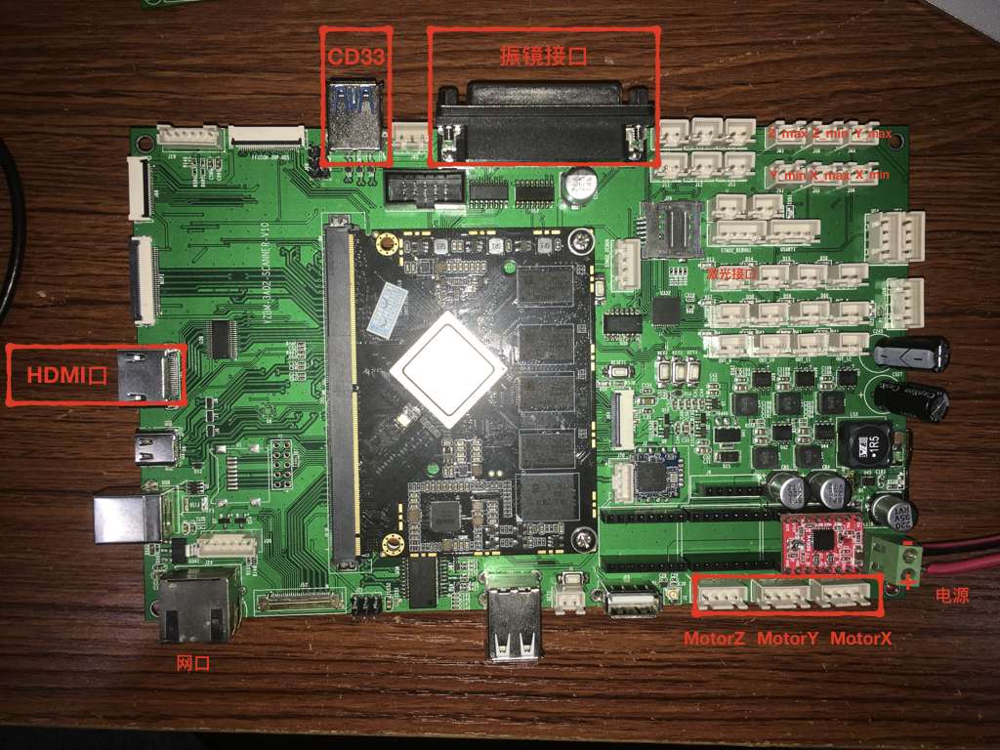

* content
{:toc}
## 用户需求

SCANNER_01 是为黑金刚研发的多通道扫描仪底板。

### 用户需求文档

#### V1

#### V2

其中和我们有关的是5和6

##### 修改5 把OUT1到OUT4改成继电器输出

删掉OUT_1到OUT_4这4个座子，用OUT_5V_OD_1到OUT_5V_OD_4这4个NET去控制继电器

##### 修改6 把OUT5到OUT8改成DA输出

删掉整个第6和第7页

删掉5页下面的电路

删掉5页下面的电路

### 需求表格

| 端口         | 数量 | 备注           |      |
| ------------ | ---- | -------------- | ---- |
| USB摄像头    | 4    | UVC摄像头      |      |
| 步进电机     | 3    | A4988          |      |
| 激光扫描接口 | 2    | 线激光和点激光 |      |
| 模拟输出     | 4    | PWM调压        |      |
| 数字输出     | 8    | 0 1 输出       |      |
| 数字输入     | 6    | 12V光耦        |      |

### 接线图

### 设计架构图

这里U1是主CPU，U2和U3是两个控制用MCU

## U1<->U2 的协议（又称为SPI协议）
SPI是双工协议，读写同时进行，总包长 20bytes

### U2->U1 激光控制协议

这个包的内容是从RK3399来的扫描点信息，定义了激光扫描的3维坐标

| 编号          | 类型     | 名称       | 备注         |
| ------------- | -------- | ---------- | ------------ |
| Byte0         | uint8_t  | head       | 0x68         |
| Byte1         | uint8_t  | seq        | 自增序列号   |
| Byte2         | uint8_t  | pktType    | 包类型 = 1   |
| Byte3         | uint8_t  | ctrl       | 控制位       |
| Byte4~Byte7   | uint16_t | posXY[2]   | 目标位置     |
| Byte8~Byte11  | uint16_t | stepCnt[2] | 插点数量     |
| Byte12~Byte15 | int16_t  | stepXY[2]  | 插点空间间距 |
| Byte16        | uint8_t  | stepPeriod | 插点时间间距 |
| Byte17        | uint8_t  | reserve    | 备用         |
| Byte18        | uint8_t  | tail       | 0xFF         |
| Byte19        | uint8_t  | checksum   | 校验和       |
其中ctrl内容如下

| 7        | 6        | 5        | 4        | 3        | 2       | 1     | 0       |
| -------- | -------- | -------- | -------- | -------- | ------- | ----- | ------- |
| reserved | reserved | reserved | reserved | reserved | AutoOff | onOff | isReset |

特别的，如果只需要读而不需要写的时候，用下面这个dummy包

### U1->U2 队列反馈协议

这个包是从stm32到RK3399的反馈信息，反馈了stm32里面的缓存状态

| 编号         | 类型    | 名称      | 备注       |
| ------------ | ------- | --------- | ---------- |
| Byte0        | uint8_t | head      | 0x68       |
| Byte1        | uint8_t | seq       | 自增序列号 |
| Byte2        | uint8_t | pktType   | 包类型 = 1 |
| Byte3        | uint8_t | capacity  | 剩余容量   |
| Byte4~Byte18 | uint8_t | dummy[15] | Dummy      |
| Byte19       | uint8_t | checksum  | 校验和     |

## U1<->U3的协议（又称为I2C协议）

### U1->U3 这个包是电机指令控制包

| 编号          | 类型     | 名称        | 备注                                                         |
| ------------- | -------- | ----------- | ------------------------------------------------------------ |
| Byte0         | uint8_t  | head        | 0x68                                                         |
| Byte1         | uint8_t  | seq         | 自增序列号                                                   |
| Byte2         | uint8_t  | pktType     | 包类型 = 1                                                   |
| Byte3         | uint8_t  | dir         | 每个bit代表一个轴正转还是反转                                |
| Byte4         | Uint8_t  | endstop_min | 每个bit代表一个轴的min的停止条件，min要是dir为0碰的方向。1 |
| Byte5         | Uint8_t  | Endstop_max | 每个bit代表一个轴的max的停止条件，max是dir位1碰的方向2 |
| Byte6~Byte33  | uint32_t | step[7]     | 7个步进电机的步数                                            |
| Byte34~Byte35 | uint16_t | accBefore   | 主轴加速步数                                                 |
| Byte36~Byte37 | Uint16_t | decAfter    | 主轴减速步数                                                 |
| Byte38~Byte39 | Uint16_t | AccValue    | 加速度值                                                     |
| Byte40~Byte41 | Uint16_t | Dda_rate    | 主轴速度(HZ)                                                 |
| Byte42~Byte43 | Uint16_t | O           | 输出状态                                                     |
| Byte44        | uint8_t  | tail        | 0xFF                                                         |
| Byte45        | uint8_t  | checksum    | 校验和                                                       |

注1：例如想要y走到最小方向，碰撞开关的输入状态为1时停止，则endstop_min = 0b00000010; 

注2: 例如想要z走到最大方向，碰撞开关的输入状态为0时停止，则endstop_min = 0b00000000;

### U3->U1 这个包是电机状态反馈包

| 编号          | 类型     | 名称     | 备注        |
| ------------- | -------- | -------- | ----------- |
| Byte0         | uint8_t  | head     | 0x68        |
| Byte1         | uint8_t  | seq      | 自增序列号  |
| Byte2         | uint8_t  | pktType  | 包类型 = 2  |
| Byte3         | uint8_t  | capacity | 队列长度    |
| Byte4~Byte17  | int16_t  | posXY[7] | 7轴累计位置 |
| Byte18~Byte19 | uint16_t | I        | 输入状态    |
| Byte20        | uint8_t  | tail     | 0xFF        |
| Byte21        | uint8_t  | checksum | 校验和      |

##调试顺序

- [x] SPI收发
- [x] I2C收发
- [x] I2C 
  - [x] stm32->RK3399出现问题。
  - [x] 协议
- [x] 电机运动
- [x] IO控制
- [ ] 应用进程通讯

##BUG 记录

I2C stm32->RK3399出现问题。STM32端报Acknowledge Failure SR1->AF错误

