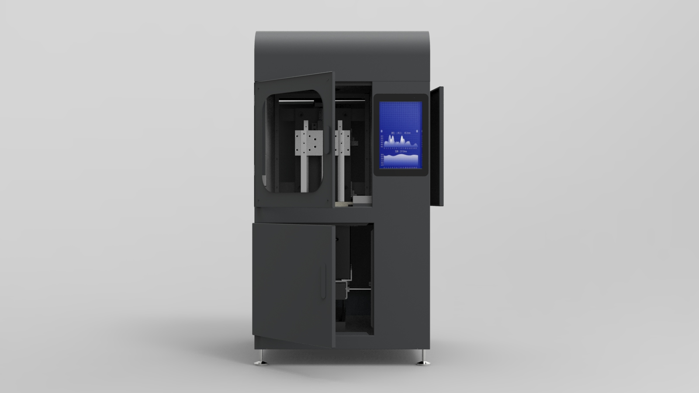
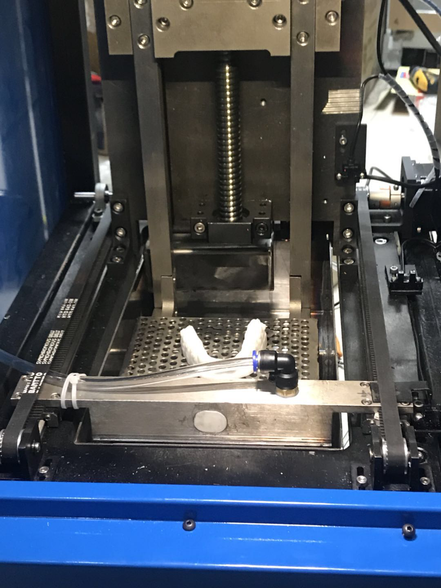
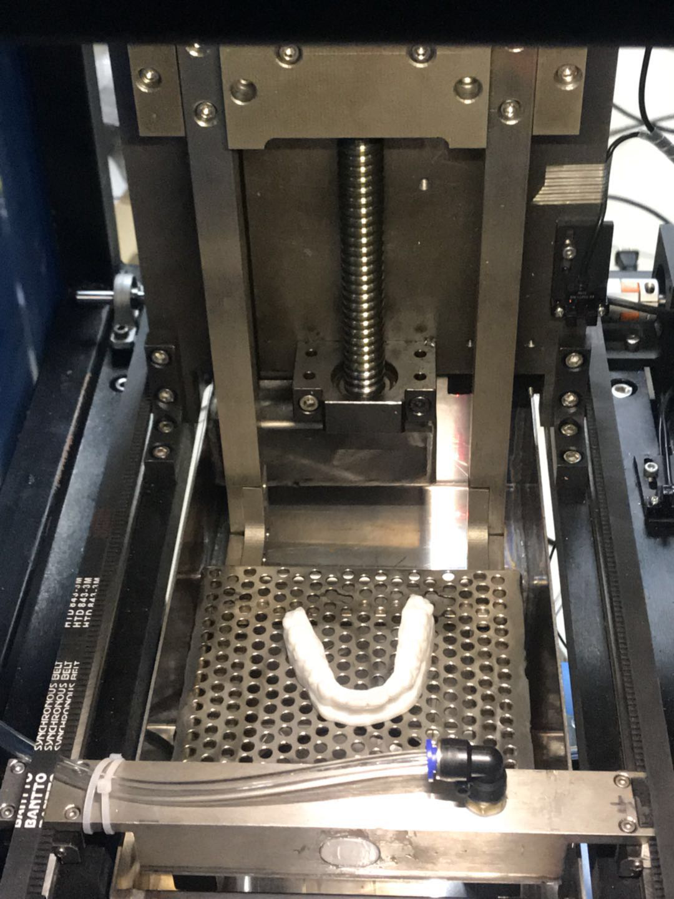
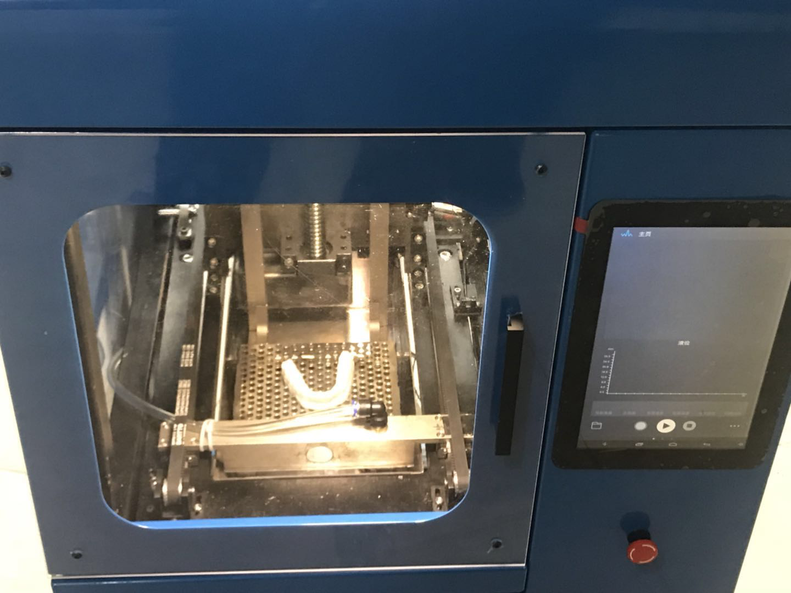
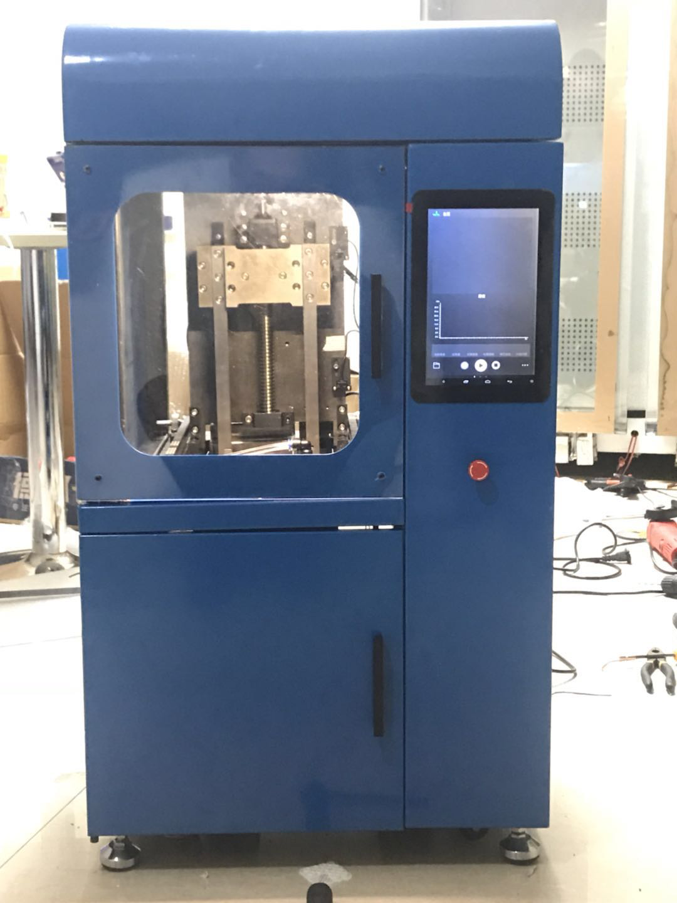

# RAYLAND RL-150型 SLA打印机数据手册

## 概述

RL-150型SLA打印机是锐蓝推出的工业级下沉式SLA打印机。采用了锐蓝自研的Rayland-SLA-001主板，采用一体式的电机和振镜控制系统。具备体积小，打印面积占比大，操作便捷，维修简单的优点。适用于商用打印服务和企业研发。

## 关键参数

| 项目     | 参数                    | 备注   |
| ------ | --------------------- | ---- |
| 激光波长   | 405nm                 |      |
| 成型截面积  | 150mm x 150mm         |      |
| 成型高度   | 140mm                 |      |
| 整机尺寸   | 540mm x 550mm x 980mm |      |
| 干重量    | 150kg                 |      |
| 料槽容积   | 9L                    |      |
| 打印精度   | 0.05mm                |      |
| 最高扫描速度 | 6m/s                  |      |
| 电压     | 220V                  |      |
| 功率     | <100瓦                 |      |
| 屏幕尺寸   | 9寸                    |      |
| 操作系统   | 安卓4.4                 |      |
| 支持联网方式 | WiFi，4G（可选）以太网（可选）    |      |

## 实物图

