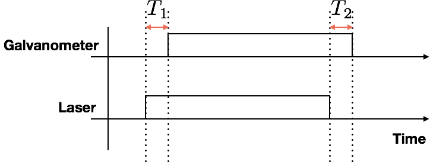

# SLA控制协议

SLA主板在使用TTL激光器控制的时候遇到一个问题就是激光器无法精准控制延迟。目前的激光控制是伴随振镜步进进行的。

也就是说每进行一次脉冲步进才能进行一次激光的开关。按照目前TIM5的频率是40khz计算。激光延迟的最小单位是插点时间间距。
$$
\Delta = \frac{1}{f} = \frac{1}{40k} = 25\mu s
$$
所以需要在这个延迟的基础上将将激光的延迟开关周期增加到1us这个单位，也就是说需要将现在的控制精度提高100倍左右，目前的激光延迟是用一个`uint16_t`的变量存储的，我们需要将这个变量的长度修改为`uint32_t`。然后在TIM5的中断响应函数里面对额外加入的这些精度进行利用。

T1:开激光延迟

T2:关激光延迟

## A33->STM32的配置包

总包长 20bytes

| 编号            | 类型       | 名称         | 备注            |
| ------------- | -------- | ---------- | ------------- |
| Byte0         | uint8_t  | head       | 0x68          |
| Byte1         | uint8_t  | seq        | 自增序列号         |
| Byte2         | uint8_t  | pktType    | 包类型           |
| Byte3         | uint8_t  | 开激光电平      | 0:低电压开，1:高电压开 |
| Byte4~Byte5   | uint16_t | onDelay    | 开激光延迟（单位us）   |
| Byte6~Byte7   | uint16_t | offDelay   | 关激光延迟（单位us）   |
| Byte8~Byte9   | uint16_t | beforeJump | 快跳延迟（单位us）    |
| Byte10～Byte17 | uint8_t  | reserve[8] | 备用            |
| Byte18        | uint8_t  | tail       | 0xFF          |
| Byte19        | uint8_t  | checksum   | 校验和           |

## A33->STM32的数据包

总包长 20bytes

| 编号            | 类型       | 名称         | 备注     |
| ------------- | -------- | ---------- | ------ |
| Byte0         | uint8_t  | head       | 0x68   |
| Byte1         | uint8_t  | seq        | 自增序列号  |
| Byte2         | uint8_t  | pktType    | 包类型    |
| Byte3         | uint8_t  | ctrl       | 控制位    |
| Byte4~Byte7   | uint16_t | posXY[2]   | 目标位置   |
| Byte8~Byte11  | uint16_t | stepCnt[2] | 插点数量   |
| Byte12~Byte15 | int16_t  | stepXY[2]  | 插点空间间距 |
| Byte16        | uint8_t  | stepPeriod | 插点时间间距 |
| Byte17        | uint8_t  | reserve    | 备用     |
| Byte18        | uint8_t  | tail       | 0xFF   |
| Byte19        | uint8_t  | checksum   | 校验和    |

ctrl内容

| 7        | 6        | 5        | 4        | 3        | 2       | 1     | 0       |
| -------- | -------- | -------- | -------- | -------- | ------- | ----- | ------- |
| reserved | reserved | reserved | reserved | reserved | AutoOff | onOff | isReset |
