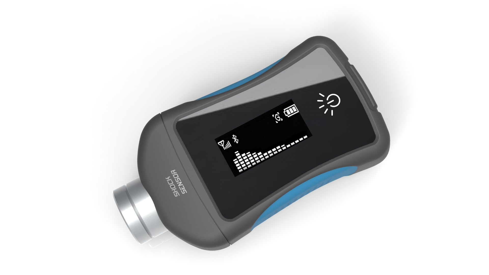
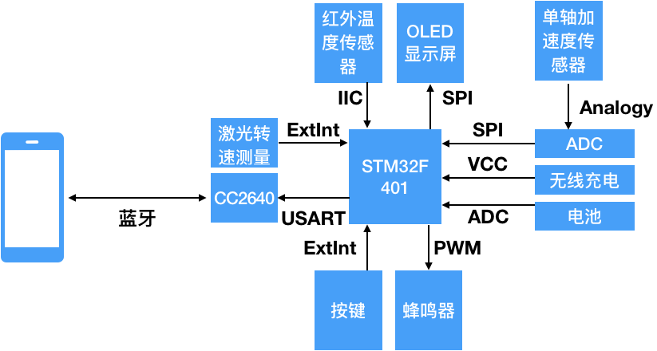

# 工业巡检仪开发内部文档



[TOC]

## 需求列表

| 需求名称         | 关键值                  | 备注               |
| ---------------- | ----------------------- | ------------------ |
| 加速度范围       | $0.1m/s^2$~$199.9m/s^2$ | 实测值             |
| 速度范围         | $0.1mm/s$~$199.9mm/s$   | 推算值             |
| 位移范围         | $0.001mm$~$1.999mm$     | 推算值             |
| 精度             | $0.1m/s^2$              | 最小加速度变化量   |
| 3db频率范围      | $1hz$~$10Khz$           | 最低频率和最大频率 |
| 谐振频率         | $23Khz$                 | 传感器最大敏感频率 |
| 电池寿命         | 10小时工作，50小时待机  |                    |
| 设备工作温度     | $-15^oC$\~$+80^oC$      |                    |
| 电池电量         | 1000mAh                 |                    |
| 充电类型         | 无线充电 QI标准         |                    |
| 本机显示         | OLED显示屏              |                    |
| 数据传输方式     | 蓝牙                    |                    |
| 交互方式         | 触摸按键+蜂鸣器         |                    |
| 温度测试范围     | $-70^oC$~$380^oC$       |                    |
| 测量精度         | $0.5^oC$                |                    |
| 激光转速测量范围 | $1$~$30000RPM$          |                    |
| 其余功能1        | 跌落检测                |                    |
| 其余功能2        | 自动关机                |                    |

## 方案框图




## BOM列表

| 名称             | 数量 | 功能       | 供应商   |
| ---------------- | ---- | ---------- | -------- |
| stm32f401        | 1    | 主芯片     | 成品采购 |
| 激光转速测量     | 1    | 测量转速   | 成品采购 |
| cc2640           | 1    | 蓝牙通讯   | 成品采购 |
| 按键             | 1    | 用户交互   | 开模加工 |
| 蜂鸣器           | 1    | 按键提醒   | 成品采购 |
| 电池             | 1    | 供电       | 成品采购 |
| 无线充电         | 1    | 充电       | 成品采购 |
| ADC              | 1    | 高速采样   | 成品采购 |
| 单轴加速度传感器 | 1    | 振动转电压 | 委托定制 |
| OLED             | 1    | 用户交互   | 成品采购 |
| 红外温度传感器   | 1    | 测温       | 成品采购 |


## 程序流程图和关键说明

一共有两个嵌入式程序，分别烧录在stm32里和cc2640里面

### stm32程序

#### BSP和初始化

负责上述9种外设的端口初始化和供电使能。

```c
  timerInit();//初始化计时器
  USART_Config();//初始化串口
  boardInit();//初始化其他外设
```


#### FFT计算

用来计算从单轴加速度传感器拿到的振动信号的主频率,这部分非常简单，就是调用STM32F401里面的硬件dsp来做fft算法。

```C
  //计算均值
  //减去均值
  for(int i=0;i<FFTLEN;i++){
      sum+=ADCArray[i];
  }
  arrayMean = sum/FFTLEN;
  var = 0;
  for(int i=0;i<FFTLEN;i++){
      fftIn[i*2] = ADCArray[i]-arrayMean;
      fftIn[i*2+1] =0;
      var+=abs(fftIn[i*2]);
      if(abs(fftIn[i*2])>arrayMax){
	  arrayMax = abs(fftIn[i*2]);
      }
  }
  varMean = var/4096;
  scale = 32768/arrayMax;
  //scale
  for(int i=0;i<FFTLEN;i++){
      fftIn[i]*=scale;
  }
  arm_cfft_q15(&arm_cfft_sR_q15_len4096, fftIn, ifftFlag, doBitReverse);
  arm_cmplx_mag_q15(fftIn,FFTMag,FFTLEN);
```
#### 数据整理和频率计算

这部分是对计算出来的频率进行滑窗处理

	  q15_t shortQ[8];
	  for(int j=0;j<8;j++)
	      shortQ[j] = 0;
	  uint8_t shortQLen=0;
	  uint8_t shortQIdx = 0;
	  for(int i=0;i<FFTLEN;i++){
	      if(shortQLen<8) shortQLen++;
	      shortQ[shortQIdx] = FFTMag[i];
	      shortQIdx =(shortQIdx+1)%8; 
	      int32_t shortQSum = 0;
	      for(int j=0;j<8;j++){
		  shortQSum+=shortQ[j];
	      }
	      FFTMag[i] = shortQSum/shortQLen;
	  }
	  arm_max_q15(FFTMag,FFTLEN,&fftMax,&fftMaxIdx);
	  if(fftMaxIdx>2049) fftMaxIdx = 0;
	  if(varMean<20){
	      fftMaxIdx = 0;
	      fftMax = 0;
	  }
	  fftMax_sub2 = FFTMag[fftMaxIdx/2];
	  fftMax_sub3 = FFTMag[fftMaxIdx/3];
这部分是重中之重，是对多次谐波进行过滤

	  if(fftMaxIdx>100){
	      if(fftMax_sub2>fftMax/FACTOR && fftMax_sub3<fftMax/FACTOR) fftMaxIdx = fftMaxIdx/2;
	      if(fftMax_sub3>fftMax/FACTOR && fftMax_sub2<fftMax/FACTOR) fftMaxIdx = fftMaxIdx/3;
	  }
	
	  maxFreq = fftMaxIdx*2;
	  datCnt = 0;
#### 蓝牙发送

<TBD>

#### 屏幕显示

<TBD>

### cc2640程序

CC2640使用了外置模块

```html
https://item.taobao.com/item.htm?spm=a1z09.2.0.0.1d862e8dBAUz6P&id=580336549640&_u=ad4a6ucf0b
```

基本参数如下：


链接关系如下，只链接uart_tx, usart_rx, +3.3v，GND这4个

注意供电需要3.3V


需要接到给2640现在的串口上


现在的发送格式

| 波特率 | 参数 | 蓝牙名字    | UUID |
| ------ | ---- | ----------- | ---- |
| 115200 | 8N1  | Vlogger-001 | FFE0 |

DIO_001也就是Pin17需要连接到STM32的管脚上

同时PA9是需要空出来的，因为PA9是串口


## 蓝牙协议

蓝牙基本信息：

| 参数名        | 参数值         | 备注 |
| ------------- | -------------- | ---- |
| 蓝牙名称      | Vlog-001       |      |
| 蓝牙波特率    | 115200         |      |
| UUID          | 0xFE00，0xFE01 |      |
| BLE发射功率   | 5dbm           |      |
| BLE接收灵敏度 | -97dbm         |      |
| 静态功耗      | 200uA          |      |
| 工作功耗      | 2.9mA          |      |

| 字节编号 | 内容      | 值                                            |
| -------- | --------- | --------------------------------------------- |
| 1        | 包头      | 0xFF                                          |
| 2        | 特征      | 0x68是震动包，0x86是其他包                    |
| 3        | Payload_H | 在振动包里面是数据高8位，其他包里面是温度     |
| 4        | Payload_L | 再振动包里面是数据低8位，其他包里面是激光转速 |
| 5        | 包尾      | 0xFF                                          |

参考解析代码

```python
#!/usr/local/homebrew/bin/python3
import serial
import struct
import sys
import datetime
import matplotlib.pyplot as plt
import scipy.fftpack
import numpy as np;
combinfactor = 16;
plt.axis([0,17000,21000,25000]);
plt.ion();
#ser = serial.Serial('/dev/cu.wchusbserial14140',460800,timeout=10);
ser = serial.Serial('/dev/cu.wchusbserial14140',115200,timeout=10);
buf = bytearray();
charCnt =0;
readState = 0;
isEOF = 0;
sampleCnt = 0
curTemp = 0
curRotate = 0;


while 1:
    char = ser.read(1);

    dChar = struct.unpack('B',char)[0];
    if (readState == 2):
        if isEOF:
            curTemp = struct.unpack('b',char)[0];
            print("temp ="+str(curTemp));
            char = ser.read(1);
            curRotate = struct.unpack('B',char)[0]
            print("rotate ="+str(curRotate));
            char = ser.read(1);
        else:
            buf+=char;
            char = ser.read(1);
            buf+=char;
            char = ser.read(1);
            charCnt += 2
            sampleCnt += 1;
        readState = 0;
    elif (readState == 1):
        if dChar ==0x68 or dChar==0x86:
            readState += 1
            if dChar == 0x86:
                isEOF = 1;
        else:
            readState = 0
        continue;
    elif (readState ==0):
        if(dChar ==0xff):
            readState += 1
        continue;

    if(isEOF):
        print("isEOF");
        isEOF = 0;
        #t = bytes(buf);
        #print(len(buf))
        #dBuf = bytes(buf);
        print(charCnt);
        print(sampleCnt);
        dBuf = struct.unpack(">"+sampleCnt*"H",buf);

```


### V3版原理图修改意见

1. 蓝牙模块的DIO_001也就是Pin17需要连接到STM32的管脚上

2. 32K晶体确定没有接错口？应该是接错了，如果是就把IN1挪到PC13

   然后把现在的IN1用来测试电池电压，测试方法为电池电压用1M和1M欧电阻分压

   

3. PB0和PB1接100k上拉到3.3

4. 蜂鸣器三极光换成s8050，电路接发换一下

   


##  DEBUG列表

- [ ] 多次谐波滤除部分有时会发生错误


