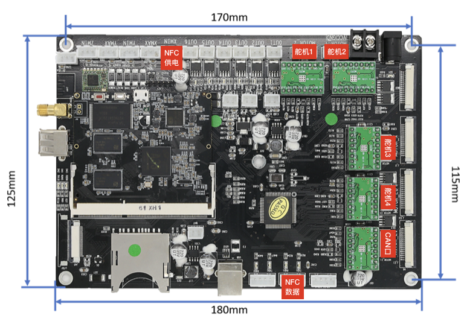
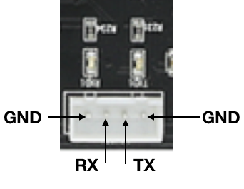

# 帮团售货柜控制协议

[TOC]

## 概述

控制器共包括如下套件

| 部件     | 数量   | 备注            |
| ------ | ---- | ------------- |
| 舵机     | 4    | 均为180度舵机      |
| 光学碰撞开关 | 3    |               |
| 磁性碰撞开关 | 3    |               |
| USB摄像头 | 1    | UVC摄像头        |
| USB网卡  | 1    | RTL8152       |
| 热敏电阻   | 1    |               |
| 继电器板   | 1    | 控制压缩机         |
| 喇叭     | 1    | 通过运放          |
| 麦克风    | 1    | 单mic          |
| 7寸屏幕   | 1    | 调试用（一批发货只配一个） |
| LED输出  | 6    |               |

## 硬件接线

### Dual板接线

|     板上端口     |     售货机功能链接     |             备注              |
| :--------------: | :--------------------: | :---------------------------: |
| X\Y\Z\EO电机端口 |         舵机*4         | 1信号线(EN)2VCC(5V)3GND(GND)  |
|     CAN口*1      |     接CAN的PHY小板     | 1 VCC   2 CAN_H  3CAN_L 4 GND |
|   限位开关口*6   | 光电开关*3  霍尔开关*3 |     1信号线2GND3VCC（5V）     |
|     OUT口*6      |         LED灯          |          1信号线2VC           |

### 分线器板接线

| 板上端口 |             接线             |
| :------: | :--------------------------: |
| CAN口*8  | 1 VCC   2 SCL   3 SDA  4 GND |

### 称板（1、2版本）接线	

|     板上端口     |             接线             |
| :--------------: | :--------------------------: |
|     CAN口*1      | 1 VCC   2 SCL   3 SDA  4 GND |
| 称重传感器接口*8 |  1 VCC   2 TX   3 RX   4GND  |

###NFC板接线

NFC电源口如下

总体连接关系如下

## 通讯协议

从I2C总线走，所以无需包头包尾和校验位

### 控制包 A33->STM32

总包长 13

| 编号           | 数据类型    | 项目            | 备注                                      |
| ------------ | ------- | ------------- | --------------------------------------- |
| Byte0        | uint8_t | seq           | 序列号：0～255                               |
| Byte1        | uint8_t | Type          | 包类型：0                                   |
| Byte2～Byte5  | uint8_t | sweeperPos[4] | 舵机值：0～255 对应1～2ms输出 对应0～180角度 |
| Byte6~Byte11 | uint8_t | outVal[6]     | out1到out6的输出值：0～255                     |
| Byte12       | int16   | ExtTargetTemp | 外置温控器目标温度：-300～300                      |

### 状态包 STM32->A33

| 编号              | 数据类型     | 项目                | 备注                  |
| --------------- | -------- | ----------------- | ------------------- |
| Byte0           | uint8_t  | seq               | 序列号：0～255           |
| Byte1           | uint8_t  | Type              | 包类型：1               |
| Byte2~Byte9     | uint16_t | ADCValue[4]       | 传感器值: 0~4095        |
| Byte10～Byte11   | int16_t  | ThermalCouple     | 热电偶温度值：-300～300     |
| Byte12～Byte13   | int16_t  | ExtCurTemp        | 外置温控器当前温度：-300～300  |
| Byte14～Byte17   | uint8_t  | sweeperPos[4]     | 舵机当前值：0～255         |
| Byte18~Byte21   | uint8_t  | outVal[4]         | out1到out6的当前值：0～255 |
| Byte22          | uint8_t  | hitWall           | 碰撞开关状态              |
| Byte23～Byte38   | uint16_t | weightOfLayer1[8] | 第一层的重量              |
| Byte39～Byte54   | uint16_t | weightOfLayer2[8] | 第二层的重量              |
| Byte55～Byte70   | uint16_t | weightOfLayer3[8] | 第三层的重量              |
| Byte71～Byte86   | uint16_t | weightOfLayer4[8] | 第四层的重量              |
| Byte87～Byte102  | uint16_t | weightOfLayer5[8] | 第五层的重量              |
| Byte103~Byte118 | uint16_t | weightOfLayer6[8] | 第六层的重量              |
| Byte119~Byte134 | uint16_t | weightOfLayer7[8] | 第七层的重量              |
| Byte135~Byte150 | uint16_t | weightOfLayer8[8] | 第八层的重量              |

byte 22的bit格式
| 7        | 6        | 5    | 4    | 3    | 2    | 1    | 0    |
| -------- | -------- | ---- | ---- | ---- | ---- | ---- | ---- |
| reserved | reserved | Zmax | Zmin | Ymax | Ymin | XMAX | XMin |

重量包 STM32->A33

## 控制界面

<TBD>