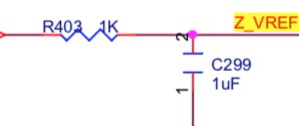

# 舵机车调试内部手册

## 接线

一共有两个电机口，分别是舵机和主电机

| 板上电机端口 | AGV功能链接 | 备注                                                         |
| ------------ | ----------- | ------------------------------------------------------------ |
| Z电机端口    | 转向驱动    | SV(PWM转向)，ST（手刹车控制），EN（手刹车状态）              |
| Y电机端口    | 后轮驱动    | SV(sv调速)，dir（反向），ST(刹车1)，MS1（刹车2），MS2(刹车3)，EN（PG） |
| E0~E1        | CAN+USART3  | E1_STEP(USART3_TX),E1_DIR(USART3_RX),E0_DIR(CAN_RX),E1_EN(CAN_TX) |

板子上需要做两处修改：

1. 焊接掉C299
2. R403短接或者换0欧

## 控制方法程序

### 转向

转向为舵机转向，脉冲宽度为1ms~2ms，其中1.5ms为归中

### 驱动

驱动为一个电压调速，满速度为3.3V，注意，启动时0~3.3的延迟要大于200ms，不然会进入保护状态

### 刹车

刹车为准ABS，脉冲三档可调

## 协议

###PC->STM32

包有效时间为2秒，超过两秒会停车且不刹车

| Byte  | Param | Describe | Type  |  Range   |                                                Unit |
| ----- | ----- | :------: | :---: | :------: | --------------------------------------------------: |
| Byte0 | 包头  |   0x68   | uint8 |          |                                                     |
| Byte1 | 转向  |   朝向   | int8  | -127~127 |                                          归一化角度 |
| Byte2 | 速度  | 当前速度 | int8  | -127~127 | 0:手刹车，1：脚刹车，其余为速度，速度值为归一化速度 |
| Byte3 | 包尾  |   0xFF   | uint8 |          |                                                     |

###Stm32->PC

| Byte        | Param    | Describe | Type  |    Range     |                                                Unit |
| ----------- | -------- | :------: | :---: | :----------: | --------------------------------------------------: |
| Byte0       | 包头     |   0x68   | uint8 |              |                                                     |
| Byte1~Byte2 | 里程     |   里程   | int8  | -32768~32768 |                                             1/100圈 |
| Byte3       | 当前速度 |   速度   | int8  |   -127~127   | 0:手刹车，1：脚刹车，其余为速度，速度值为归一化速度 |
| Byte4       | 包尾     |   0xFF   | uint8 |              |                                                     |

### 物理协议

#### rs232

波特率为9600，8N1

#### CAN

波特率为125Kbps