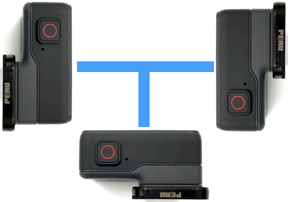

#车顶相机方案

## 相机阵列

需求：室外放水，4K高清，定焦

### 摄像头

http://www.goprochina.cn/

### 软件

https://www.ptgui.com/

**PTGui**是一款基于[Windows](https://zh.wikipedia.org/wiki/Windows)与[Mac OS X](https://zh.wikipedia.org/wiki/Mac_OS_X)平台的[全景摄影](https://zh.wikipedia.org/wiki/%E5%85%A8%E6%99%AF%E6%91%84%E5%BD%B1)照片拼接软件，由New House Internet Services BV开发并维护。

PTGui最初是一款基于Helmut Dersch's Panorama Tools的[图形化界面](https://zh.wikipedia.org/wiki/%E5%9B%BE%E5%BD%A2%E5%8C%96%E7%95%8C%E9%9D%A2)前台程序。主要功能包含[图像拼接](https://zh.wikipedia.org/w/index.php?title=%E5%9B%BE%E5%83%8F%E6%8B%BC%E6%8E%A5&action=edit&redlink=1)与混合，支持长焦，普通与广角及[鱼眼镜头](https://zh.wikipedia.org/wiki/%E9%B1%BC%E7%9C%BC%E9%95%9C%E5%A4%B4)所拍摄的照片，支持创建普通，圆柱以及球形全景照片。

**PTGui Pro**还包含[HDR](https://zh.wikipedia.org/wiki/HDR)与[色调映射](https://zh.wikipedia.org/wiki/%E8%89%B2%E8%B0%83%E6%98%A0%E5%B0%84)功能。

## GPS logger

ublox

G-MOUSE卫星接收器（以下简称G-MOUSE），是一个完整的卫星定位接收机。内建卫星接收天线，并采用卫星接收核心，具有全方位功能，能满足工业级定位的严格要求与个人使用需要。适用范围从汽车导航、汽车防盗、公交报站，车载硬盘录像机，车载视频监控，车载DVD导航，DVR，汽车音响，车载监控，车载终端，tracking、保全系统、个人定位、各种调查到农业用途等。使用的基本需求只有（适当的电源供应和面对天空）。

产品简介

数据接口：

USB接口

波特率：

4800,9600,38400,115200自适应波特率

支持系统：

windows xp/win7/win8.

协议：

NMEA-0183标准协议

线长：

1.5-2米

GPS模组：U-blox　G6010，50通道

坐标基准：WGS-84

定位精度：5m

定位时间冷开机：42s，暖开机：38s，热开机：1s

输入信息：NMEA／SiRF二进制设定

输出信息：NMEA-0183-GGA，GSA，GSV，RMC，VTG，GLL 

## 供电系统

GPS logger和Gopro都是5V供电，用车载供电即可满足

## 存储系统

轨迹存储用usb口直接存储再电脑里。显示数据用TF卡存储在相机里面，每日行程结束后将，gopro接入电脑，即可自动导入PC进行存储。

## 预算

| 设备       | 单价 | 数量 | 总价  |
| ---------- | ---- | ---- | ----- |
| Go Pro     | 4000 | 4    | 16000 |
| ublox      | 500  | 1    | 500   |
| 车顶固定架 | 2000 | 1    | 2000  |
| 硬盘       | 2000 | 1    | 2000  |
| tf卡       | 200  | 10   | 2000  |