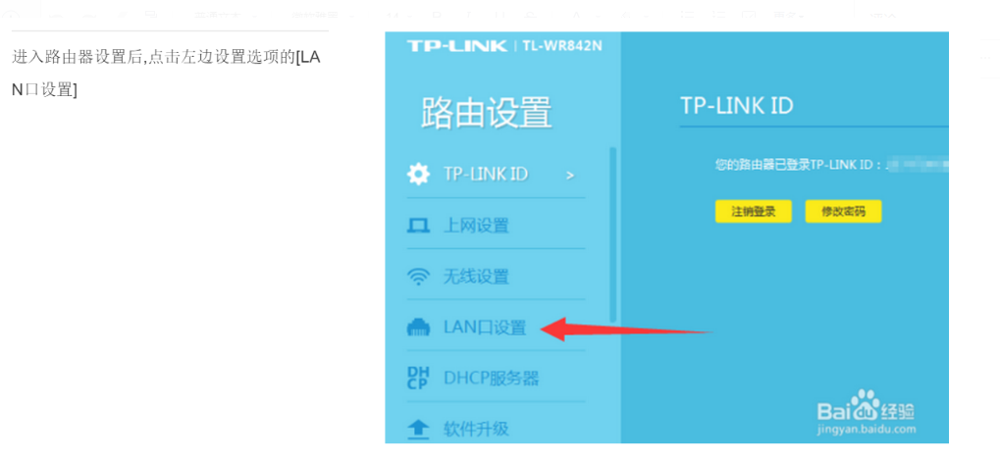
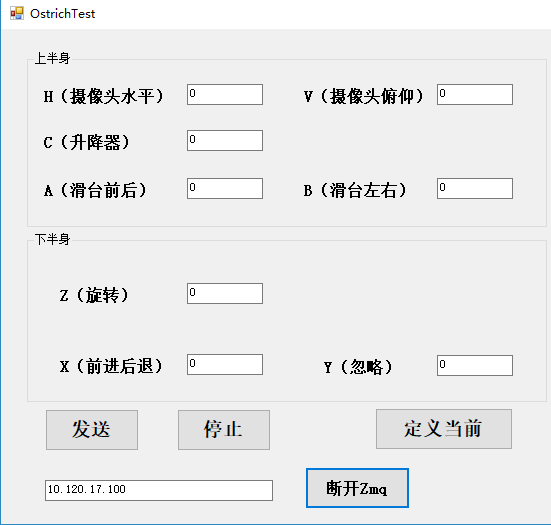

# 鸵鸟机器人

本文简单介绍了用rayland-dual主板控制鸵鸟机器人的接线方法和控制协议。

### 鸵鸟机器人接线方法

|      `设备`      | `个数` |
| :------------: | :--: |
|      RFID      |  1   |
|     16通道寻磁     |  1   |
| rayland-dual主板 |  2   |
|     摄像云台舵机     |  2   |

### 总体接线图

### 主板

| 板上电机端口 | 鸵鸟功能链接 |                备注                |
| :----: | :----: | :------------------------------: |
| X电机端口  |  左轮驱动  | 1FR(EN)2BK(MS1)3PG(MS2)4GND(GND) |
| Y电机端口  |  右轮驱动  | 1FR(EN)2BK(MS1)3PG(MS2)4GND(GND) |
| Z电机端口  | 旋转轴驱动  | 1FR(EN)2BK(MS1)3PG(MS2)4GND(GND) |
| E0电机端口 |   空    |                空                 |
| E1电机端口 | 16通道寻磁 |    1GND2TX(STEP)3RX(DIR)4GND     |
| USART1 |  RFID  |        1GND,2TX,3RX,4GND         |
| USART2 | 与从板桥接  |        1GND,2TX,3RX,4GND         |
|  USB口  | USB转网口 |                                  |

### 从板

| 板上电机端口 | 鸵鸟功能链接 |                备注                |
| :----: | :----: | :------------------------------: |
| X电机端口  | 滑台前后驱动 | 1FR(EN)2BK(MS1)3PG(MS2)4GND(GND) |
| Y电机端口  | 滑台左右驱动 | 1FR(EN)2BK(MS1)3PG(MS2)4GND(GND) |
| Z电机端口  | 升降轴驱动  | 1FR(EN)2BK(MS1)3PG(MS2)4GND(GND) |
| E0电机端口 |   空    |                空                 |
| E1电机端口 | 摄像云台舵机 |     1GND2TX（EN）3RX（MS1）4GND      |
| USART2 |  与主板   |        1GND,2TX,3RX,4GND         |

### 远程控制鸵鸟机器人的网络配置

测试时将电脑连接到机器上配备的路由器网络。

1.配置路由器ip地址，将LAN口ip设置改成为10.120.17.1，如下图所示。

2.打开控制软件ostrich，输入相应的IP地址：10.120.17.100。能正常收发数据后，开始进行遥控测试。

